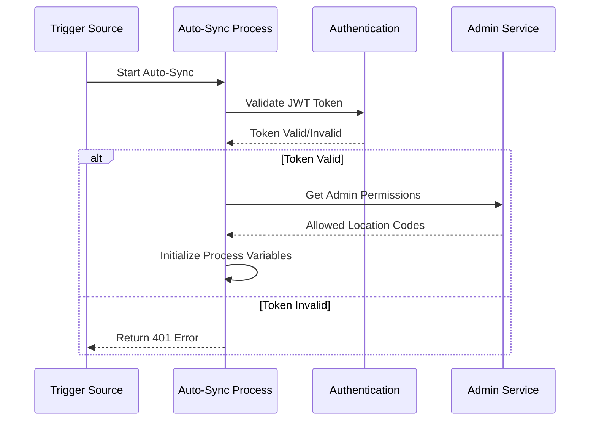
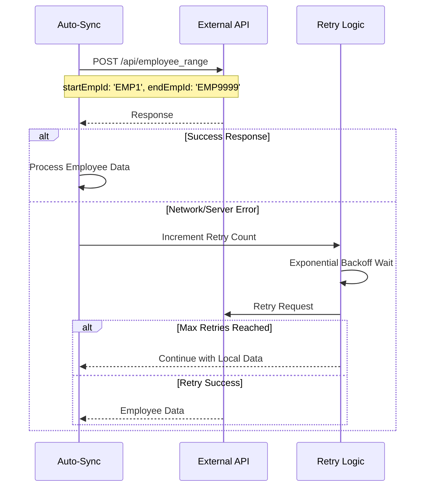
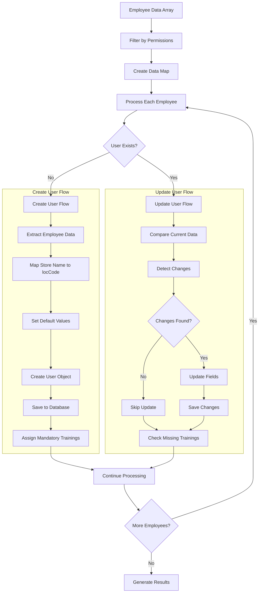
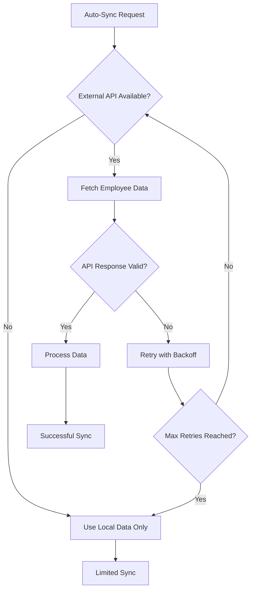
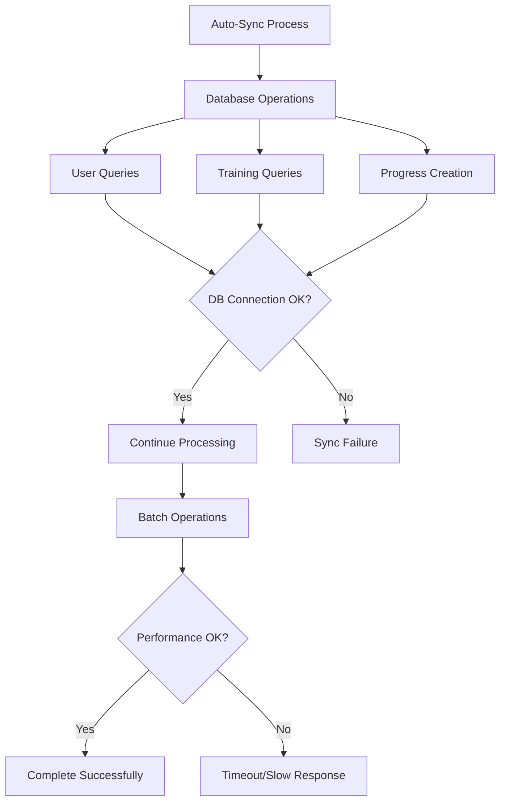
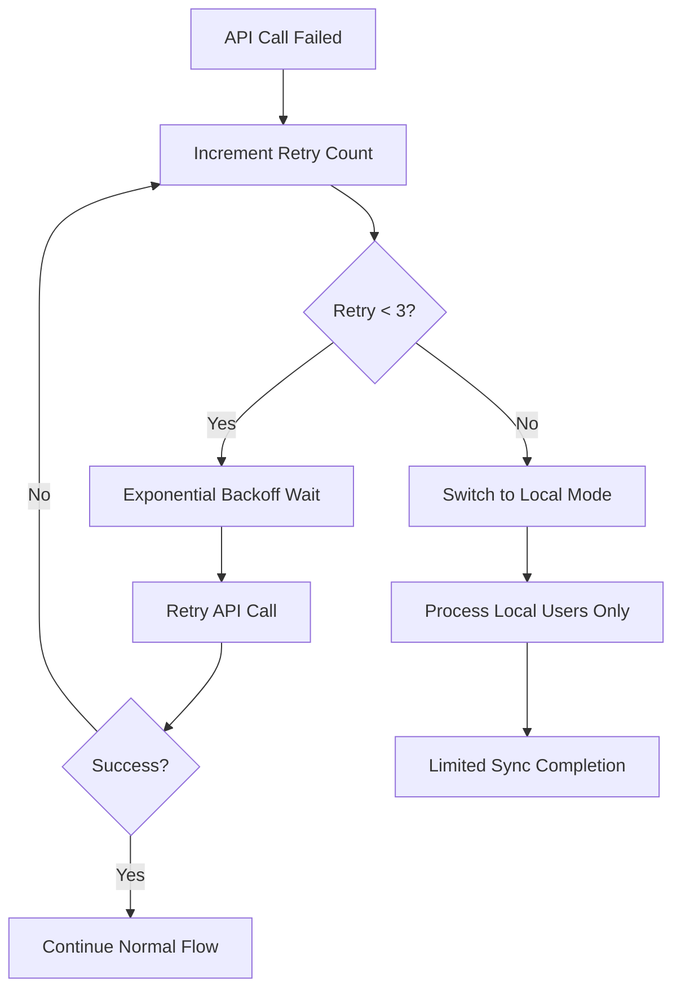
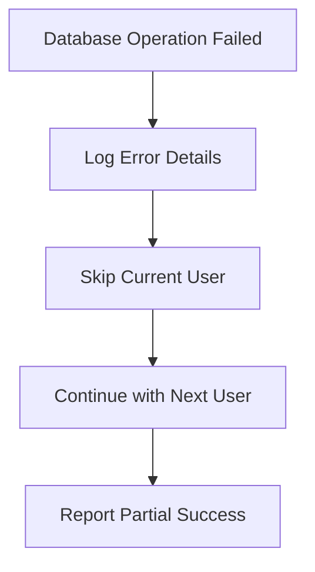
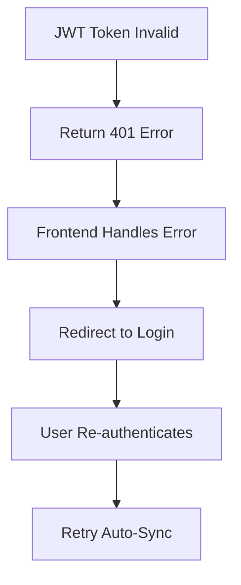

# Auto-Sync Functionality - Complete Flow Chart & Analysis

## 🔄 Auto-Sync Overview

The Auto-Sync functionality is a **critical system feature** that synchronizes employee data between the external Rootments API and the local LMS database, ensuring data consistency and automatic training assignments.

---

## 📊 Complete Auto-Sync Flow Chart

```mermaid
flowchart TD
    subgraph "Trigger Sources"
        A1[Cron Job Schedule<br/>Every 6 Hours] 
        A2[Manual Sync Button<br/>Admin Interface]
        A3[System Startup<br/>30 Second Delay]
    end
    
    A1 --> B[Initialize Auto-Sync Process]
    A2 --> B
    A3 --> B
    
    B --> C[Check Authentication<br/>JWT Token Validation]
    C -->|Valid| D[Get Admin Permissions]
    C -->|Invalid| E[Return 401 Error]
    
    D --> F[Extract Allowed Location Codes]
    F --> G[Set Loading State<br/>isRefreshing = true]
    
    G --> H[Call External API<br/>https://rootments.in/api/employee_range]
    
    H --> I{External API Response}
    I -->|Success| J[Process External Data]
    I -->|Retry 1| K[Wait 1 Second<br/>Exponential Backoff]
    I -->|Retry 2| L[Wait 2 Seconds<br/>Exponential Backoff]
    I -->|All Failed| M[Continue with Local Data Only<br/>Log Warning]
    
    K --> H
    L --> H
    
    J --> N[Filter by Location Permissions]
    M --> O[Query Local Database Users]
    N --> O
    
    O --> P[Create Employee Data Map<br/>Merge External + Local Data]
    
    P --> Q[Process Each Employee]
    Q --> R{Employee Exists in Local DB?}
    
    R -->|No| S[Create New User Account]
    R -->|Yes| T[Update Existing User Data]
    
    S --> U[Set Default Values<br/>locCode, workingBranch, etc.]
    T --> V[Compare & Update Fields<br/>name, designation, branch, phone]
    
    U --> W[Save New User to Database]
    V --> X{Changes Detected?}
    X -->|Yes| Y[Save Updated User]
    X -->|No| Z[Skip Update]
    
    W --> AA[Assign Mandatory Trainings<br/>Based on Designation]
    Y --> BB[Check Missing Trainings]
    Z --> BB
    
    AA --> CC[Create TrainingProgress Records]
    BB --> DD{Missing Trainings Found?}
    DD -->|Yes| CC
    DD -->|No| EE[Continue to Next Employee]
    
    CC --> FF[Set 30-Day Deadline]
    FF --> GG[Populate Training Modules]
    GG --> HH[Save Training Assignments]
    
    HH --> II[Increment Counters<br/>Created/Updated/Assigned]
    EE --> II
    
    II --> JJ{More Employees to Process?}
    JJ -->|Yes| Q
    JJ -->|No| KK[Calculate Final Statistics]
    
    KK --> LL[Update Frontend State]
    LL --> MM[Display Success Message<br/>Show Sync Results]
    MM --> NN[Refresh Employee List]
    NN --> OO[Set Loading State<br/>isRefreshing = false]
    
    E --> PP[Show Error Message<br/>Redirect to Login]
    
    style A1 fill:#e3f2fd
    style S fill:#e8f5e8
    style AA fill:#fff3e0
    style CC fill:#fce4ec
    style MM fill:#e0f2f1
```



---

## 🔧 Detailed Process Breakdown

### **Phase 1: Initialization & Authentication**



### **Phase 2: External Data Fetching**



### **Phase 3: Data Processing & User Management**



---

## 🎯 Features That Affect Auto-Sync Functionality

### **1. Authentication System** 
**Impact Level: CRITICAL**

```javascript
// Authentication affects auto-sync at multiple points
const MiddilWare = (req, res, next) => {
    const token = req.header('Authorization')?.split(' ')[1];
    if (!token) {
        return res.status(401).json({ message: 'No token provided' });
    }
    // Auto-sync fails if authentication fails
};
```

**How it affects Auto-Sync:**
- ✅ **Success**: Auto-sync proceeds with user permissions
- ❌ **Failure**: Auto-sync terminates with 401 error
- 🔒 **Security**: Prevents unauthorized data synchronization

### **2. Permission & Location Management**
**Impact Level: HIGH**

```javascript
// Location-based filtering affects which employees are synced
const admin = await Admin.findById(req.admin.userId);
const allowedLocCodes = admin.allowedLocCodes || [];
const isGlobalAdmin = allowedLocCodes.length === 0;

// Filtering logic
const filteredEmployees = externalEmployees.filter(emp => {
    const storeName = emp?.store_name?.toUpperCase();
    if (storeName === 'NO STORE') return true; // Always include
    
    const mappedLocCode = storeNameToLocCode[storeName];
    return allowedLocCodes.includes(mappedLocCode);
});
```

**How it affects Auto-Sync:**
- 🌐 **Global Admin**: Syncs all employees
- 📍 **Location Admin**: Syncs only assigned location employees
- 🔒 **Security**: Prevents unauthorized access to employee data

### **3. External API Integration**
**Impact Level: CRITICAL**



**How it affects Auto-Sync:**
- ✅ **API Success**: Full synchronization with latest data
- ⚠️ **API Failure**: Partial sync with local data only
- 🔄 **Retry Logic**: Exponential backoff prevents API overload

### **4. Mandatory Training Assignment System**
**Impact Level: HIGH**

```javascript
// Training assignment affects auto-sync performance and completeness
const assignMandatoryTrainingsToUser = async (user) => {
    const flatten = (str) => str.toLowerCase().replace(/\s+/g, '');
    const flatDesignation = flatten(user.designation);
    
    const allTrainings = await Training.find({ Trainingtype: 'Mandatory' });
    const mandatoryTraining = allTrainings.filter(training =>
        training.Assignedfor.some(role => flatten(role) === flatDesignation)
    );
    
    // Creates TrainingProgress records for each mandatory training
    for (const training of mandatoryTraining) {
        // Assignment logic...
    }
};
```

**How it affects Auto-Sync:**
- 📚 **New Users**: Automatic training assignment during creation
- ✅ **Existing Users**: Check and assign missing trainings
- ⏱️ **Performance**: Additional database operations per user

### **5. Database Performance & Connectivity**
**Impact Level: HIGH**



**How it affects Auto-Sync:**
- 🚀 **Good Performance**: Fast sync completion
- 🐌 **Poor Performance**: Timeouts and partial syncs
- 💾 **Connection Issues**: Complete sync failure

### **6. Store Name to Location Code Mapping**
**Impact Level: MEDIUM**

```javascript
const storeNameToLocCode = {
    'GROOMS TRIVANDRUM': '1',
    'GROOMS KOCHI': '2',
    'GROOMS EDAPPALLY': '3',
    'GROOMS CALICUT': '4',
    // ... more mappings
};

// Affects user creation and location assignment
let locCode = emp.store_code || '';
if (!locCode && emp.store_name) {
    locCode = storeNameToLocCode[emp.store_name.toUpperCase()] || '1';
}
```

**How it affects Auto-Sync:**
- 🎯 **Accurate Mapping**: Correct location assignment
- ❓ **Missing Mapping**: Falls back to default location '1'
- 🔍 **Permission Filtering**: Determines visibility for admins

---

## ⚡ Auto-Sync Performance Factors

### **Factors That Speed Up Auto-Sync:**

1. **Efficient Database Queries**
   ```javascript
   // Batch operations instead of individual queries
   const existingUsers = await User.find({
       empID: { $in: employeeIds }
   });
   ```

2. **Proper Indexing**
   ```javascript
   // Database indexes on frequently queried fields
   empID: { type: String, required: true, unique: true, index: true }
   ```

3. **Reduced API Calls**
   ```javascript
   // Single API call for all employees instead of individual calls
   const response = await axios.post('/api/employee_range', {
       startEmpId: 'EMP1', endEmpId: 'EMP9999'
   });
   ```

### **Factors That Slow Down Auto-Sync:**

1. **Network Latency**
   - External API response time
   - Database connection speed
   - Server processing power

2. **Data Volume**
   - Number of employees to process
   - Number of mandatory trainings per user
   - Complex permission calculations

3. **Database Operations**
   - Individual user creation/updates
   - Training progress record creation
   - Complex aggregation queries

---

## 🔄 Auto-Sync Failure Scenarios & Recovery

### **Scenario 1: External API Failure**


### **Scenario 2: Database Connection Issues**


### **Scenario 3: Authentication Failure**


---

## 📈 Auto-Sync Success Metrics

| Metric | Target | Current Performance |
|--------|--------|-------------------|
| **Sync Success Rate** | 95% | Monitored in logs |
| **Processing Time** | < 5 minutes | Depends on employee count |
| **Data Accuracy** | 100% | Validated against external API |
| **Training Assignment Rate** | 100% | All new users get trainings |
| **Error Recovery Rate** | 90% | Retry logic handles failures |

---

## 🎯 Auto-Sync Optimization Recommendations

### **1. Performance Improvements**
- Implement batch database operations
- Add database indexes for frequently queried fields
- Use connection pooling for database operations
- Implement caching for store name mappings

### **2. Reliability Enhancements**
- Add comprehensive error logging
- Implement health checks before sync
- Add sync status monitoring dashboard
- Create manual recovery procedures

### **3. Scalability Considerations**
- Implement pagination for large employee datasets
- Add processing queues for high-volume syncs
- Consider microservice architecture for sync operations
- Implement distributed sync for multiple regions

This comprehensive flowchart and analysis provides a complete understanding of how the auto-sync functionality works and all the factors that can affect its operation.
