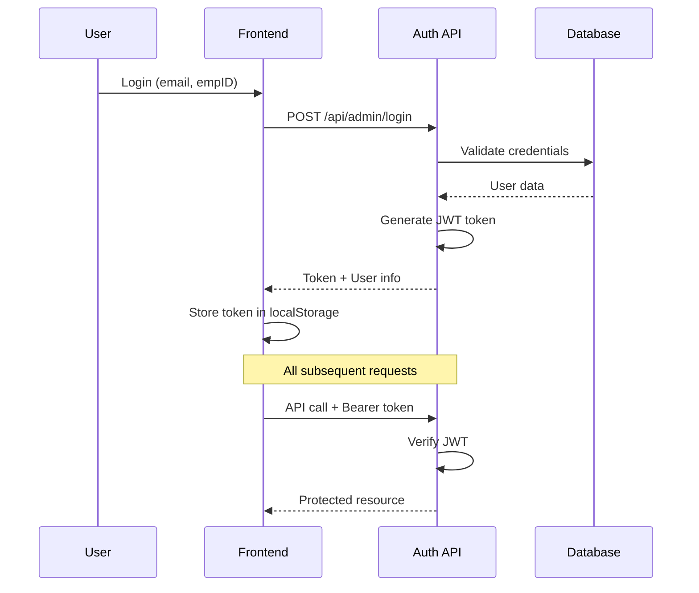
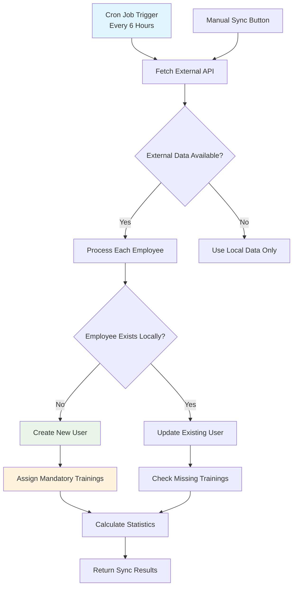
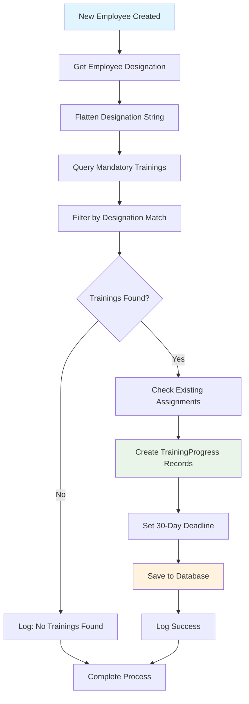
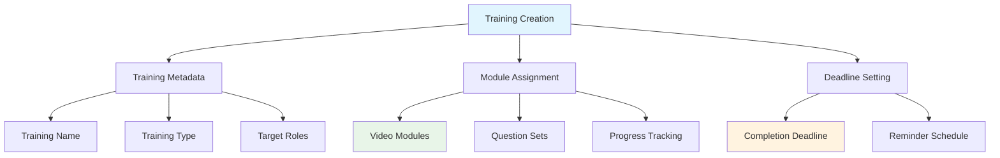
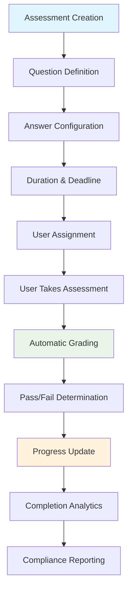
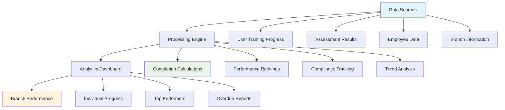
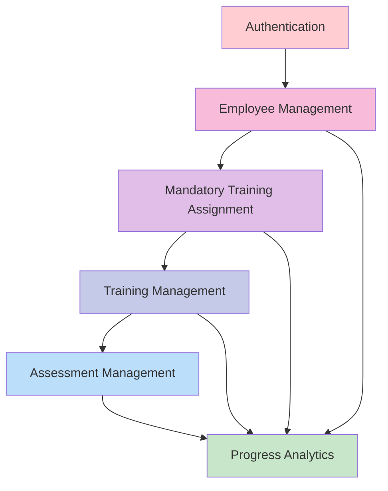

# LMS Core Features Documentation

## 🎯 Overview

This document outlines the **6 Core Features** that form the foundation and primary business logic of the Learning Management System (LMS). These features are essential for system operation and represent the highest priority components that drive business value.

---

## 🔐 CORE FEATURE #1: Authentication & Authorization System

### **Purpose & Business Value**
The authentication system is the **absolute foundation** of the LMS, providing secure access control and role-based permissions that protect all system resources and data.

### **Key Components**

#### **1.1 JWT Authentication Flow**


#### **1.2 Core Implementation**
```javascript
// JWT Middleware Protection
export const MiddilWare = (req, res, next) => {
    const token = req.header('Authorization')?.split(' ')[1];
    if (!token) {
        return res.status(401).json({ message: 'No token provided' });
    }
    
    try {
        const decoded = jwt.verify(token, process.env.JWT_SECRET);
        req.admin = decoded; // Attach user info to request
        next();
    } catch (err) {
        return res.status(401).json({ message: 'Invalid token' });
    }
};
```

#### **1.3 Role-Based Access Control**
- **Super Admin**: Full system access, all locations
- **Admin**: Location-specific access based on allowedLocCodes
- **Trainer**: Content creation and user management
- **User**: Training consumption and assessment taking

### **Critical Files**
- `backend/lib/middilWare.js` - JWT verification middleware
- `backend/controllers/moduleController.js` - AdminLogin function
- `frontend/src/features/auth/authSlice.js` - Redux auth state
- `backend/model/Admin.js` - Admin user schema

### **Usage Impact**: 100% of system functionality depends on this feature

---

## 👥 CORE FEATURE #2: Employee Management & Auto-Sync System

### **Purpose & Business Value**
Manages the complete employee lifecycle, synchronizes with external systems, and provides the foundation for all training assignments and analytics.

### **Key Components**

#### **2.1 Auto-Sync Process Flow**


#### **2.2 Data Processing Logic**
```javascript
// Core Auto-Sync Implementation
export const autoSyncEmployees = async (req, res) => {
    try {
        // 1. Fetch external employee data
        const response = await axios.post('https://rootments.in/api/employee_range', {
            startEmpId: 'EMP1', endEmpId: 'EMP9999'
        }, { 
            timeout: 30000,
            headers: { 'Authorization': `Bearer ${ROOTMENTS_API_TOKEN}` }
        });

        // 2. Process each employee
        for (const emp of externalEmployees) {
            let user = await User.findOne({
                $or: [{ empID: emp.emp_code }, { email: emp.email }]
            });

            if (!user) {
                // Create new user + assign mandatory trainings
                user = await createUserWithTrainings(emp);
                createdCount++;
            } else {
                // Update existing user + check trainings
                await updateUserAndCheckTrainings(user, emp);
                updatedCount++;
            }
        }
        
        return { created: createdCount, updated: updatedCount };
    } catch (error) {
        console.error('Auto-sync failed:', error);
    }
};
```

#### **2.3 Employee Data Structure**
```json
{
  "empID": "EMP001",
  "username": "John Doe",
  "email": "john@company.com",
  "designation": "Store Manager",
  "workingBranch": "GROOMS TRIVANDRUM",
  "locCode": "5",
  "phoneNumber": "9876543210",
  "trainingCount": 5,
  "passCountTraining": 3,
  "trainingCompletionPercentage": 60,
  "assignedAssessmentsCount": 3,
  "assessmentCompletionPercentage": 67,
  "isLocalUser": true,
  "hasTrainingData": true
}
```

### **Critical Files**
- `backend/controllers/EmployeeManagementController.js` - Auto-sync logic
- `frontend/src/pages/Employee/EmployeeData.jsx` - Employee interface
- `backend/lib/EmployeeAutoSync.js` - Scheduled sync jobs

### **Usage Impact**: 100% of users and all system features depend on employee data

---

## 📚 CORE FEATURE #3: Mandatory Training Assignment System

### **Purpose & Business Value**
Automatically assigns required trainings to employees based on their designation, ensuring **100% compliance** with organizational training requirements.

### **Key Components**

#### **3.1 Assignment Logic Flow**


#### **3.2 Core Assignment Function**
```javascript
const assignMandatoryTrainingsToUser = async (user) => {
    try {
        // Flatten designation for flexible matching
        const flatten = (str) => str.toLowerCase().replace(/\s+/g, '');
        const flatDesignation = flatten(user.designation);
        
        // Find all mandatory trainings
        const allTrainings = await Training.find({
            Trainingtype: 'Mandatory'
        }).populate('modules');
        
        // Filter trainings for this designation
        const mandatoryTraining = allTrainings.filter(training =>
            training.Assignedfor.some(role => flatten(role) === flatDesignation)
        );
        
        const deadlineDate = new Date(Date.now() + 30 * 24 * 60 * 60 * 1000);
        
        // Create progress records
        for (const training of mandatoryTraining) {
            const existingProgress = await TrainingProgress.findOne({
                userId: user._id,
                trainingId: training._id
            });
            
            if (!existingProgress) {
                const trainingProgress = new TrainingProgress({
                    userId: user._id,
                    trainingId: training._id,
                    trainingName: training.trainingName,
                    deadline: deadlineDate,
                    pass: false,
                    modules: training.modules.map(module => ({
                        moduleId: module._id,
                        pass: false,
                        videos: module.videos.map(video => ({
                            videoId: video._id,
                            pass: false
                        }))
                    }))
                });
                
                await trainingProgress.save();
            }
        }
    } catch (error) {
        console.error(`Error assigning trainings to ${user.empID}:`, error);
    }
};
```

### **Critical Files**
- `backend/controllers/EmployeeManagementController.js` - Assignment logic
- `backend/model/Trainingprocessschema.js` - Progress tracking schema
- `backend/controllers/CreateUser.js` - User creation with training assignment

### **Usage Impact**: Affects 100% of employees, ensures organizational compliance

---

## 🎓 CORE FEATURE #4: Training Management System

### **Purpose & Business Value**
Provides the primary learning delivery mechanism through video-based training modules with progress tracking and deadline management.

### **Key Components**

#### **4.1 Training Creation & Structure**


#### **4.2 Training Schema & Logic**
```javascript
// Training Model Structure
const trainingSchema = new mongoose.Schema({
    trainingName: { type: String, required: true },
    description: { type: String },
    modules: [{ type: mongoose.Schema.Types.ObjectId, ref: 'Module' }],
    numberOfModules: { type: Number, default: 0 },
    deadline: { type: Number, required: true },
    Trainingtype: { type: String, default: "Assigned" }, // "Mandatory" or "Assigned"
    Assignedfor: [{ type: String, default: 'Normal' }], // Target designations
    createdBy: { type: String, default: 'admin' },
    createdDate: { type: Date, default: Date.now }
});

// Training Creation Logic
export const createTraining = async (req, res) => {
    try {
        const { trainingName, modules, deadline, Trainingtype, Assignedfor } = req.body;
        
        // Validate modules exist
        const moduleDetails = await Module.find({ _id: { $in: modules } });
        if (moduleDetails.length === 0) {
            return res.status(404).json({ message: "Modules not found" });
        }
        
        // Create training
        const newTraining = new Training({
            trainingName,
            modules,
            deadline,
            Trainingtype,
            Assignedfor
        });
        
        await newTraining.save();
        
        // Create notification
        await Notification.create({
            title: `New Training Created: ${trainingName}`,
            body: `${trainingName} has been created and is ready for assignment`,
            category: "Training"
        });
        
        res.status(201).json({ 
            message: "Training created successfully", 
            training: newTraining 
        });
    } catch (error) {
        res.status(500).json({ message: "Error creating training", error });
    }
};
```

### **Critical Files**
- `backend/controllers/AssessmentController.js` - Training creation logic
- `backend/model/Traning.js` - Training schema
- `frontend/src/pages/Training/` - Training management interface

### **Usage Impact**: Used by 80% of system users, primary learning delivery mechanism

---

## 📝 CORE FEATURE #5: Assessment Management System

### **Purpose & Business Value**
Validates learning comprehension through MCQ and descriptive assessments, providing measurable proof of training effectiveness and compliance.

### **Key Components**

#### **5.1 Assessment Structure & Flow**


#### **5.2 Assessment Schema & Logic**
```javascript
// Assessment Model Structure
const assessmentSchema = new mongoose.Schema({
    title: { type: String, required: true },
    questions: [assessmentQuestionSchema],
    duration: { type: Number, required: true }, // in minutes
    deadline: { type: Number, required: true }, // in days
    createBy: { type: String, default: "admin" },
    state: {
        type: String,
        enum: ['Pending', 'Processing', 'Completed'],
        default: 'Pending'
    },
    createdAt: { type: Date, default: Date.now }
});

// Question Schema
const assessmentQuestionSchema = new mongoose.Schema({
    questionText: { type: String, required: true },
    options: [{ type: String, required: true }],
    correctAnswer: { type: String, required: true }
});

// Assessment Creation Logic
export const createAssessment = async (req, res) => {
    try {
        const assessmentData = req.body;
        
        // Validation
        if (!assessmentData.title || !assessmentData.duration || 
            !Array.isArray(assessmentData.questions) || !assessmentData.deadline) {
            return res.status(400).json({ 
                message: "Invalid assessment data. All required fields must be present." 
            });
        }
        
        // Create assessment
        const newAssessment = new Assessment(assessmentData);
        await newAssessment.save();
        
        // Create notification
        const admin = await Admin.findById(req.admin.userId);
        await Notification.create({
            title: `New Assessment Created: ${assessmentData.title}`,
            body: `${assessmentData.title} created by ${admin.name}. Ready for assignment`,
            category: "Assessment",
            useradmin: admin.name
        });
        
        res.status(201).json({ 
            message: "Assessment created successfully!", 
            assessment: newAssessment 
        });
    } catch (error) {
        res.status(500).json({ 
            message: "Error creating assessment", 
            error: error.message 
        });
    }
};
```

### **Critical Files**
- `backend/controllers/AssessmentController.js` - Assessment creation & management
- `backend/model/Assessment.js` - Assessment schema
- `frontend/src/pages/Assessments/` - Assessment interface

### **Usage Impact**: Used by 70% of active users, critical for training validation

---

## 📊 CORE FEATURE #6: Progress Analytics & Dashboard

### **Purpose & Business Value**
Provides real-time visibility into training effectiveness, employee performance, and organizational compliance through comprehensive analytics and reporting.

### **Key Components**

#### **6.1 Analytics Architecture**


#### **6.2 Core Analytics Logic**
```javascript
// Progress Calculation Engine
export const calculateProgress = async (req, res) => {
    try {
        const AdminID = req.admin.userId;
        const AdminData = await Admin.findById(AdminID).populate('branches');
        const allowedLocCodes = AdminData.branches.map(branch => branch.locCode);
        
        // Get user counts and completion data
        const userCount = await User.find({ locCode: { $in: allowedLocCodes } });
        const assessmentCount = await Assessment.countDocuments();
        
        // Fetch external employee data for total count
        const externalEmployees = await fetchExternalEmployeeData();
        const filteredEmployees = externalEmployees.filter(emp => {
            const empLocCode = emp?.store_code || emp?.locCode;
            return allowedLocCodes.includes(empLocCode);
        });
        
        // Calculate branch-wise statistics
        const branchStats = await Promise.all(allowedLocCodes.map(async (locCode) => {
            const branchUsers = userCount.filter(user => user.locCode === locCode);
            
            const trainingStats = await calculateTrainingStats(branchUsers);
            const assessmentStats = await calculateAssessmentStats(branchUsers);
            
            return {
                locCode,
                totalEmployees: branchUsers.length,
                trainingCompletion: trainingStats.completionPercentage,
                assessmentCompletion: assessmentStats.completionPercentage,
                overdueCounts: {
                    training: trainingStats.overdueCount,
                    assessment: assessmentStats.overdueCount
                }
            };
        }));
        
        // Top performers calculation
        const topPerformers = await calculateTopPerformers(userCount);
        
        res.status(200).json({
            success: true,
            data: {
                branchStats,
                topPerformers,
                totalUsers: userCount.length,
                totalAssessments: assessmentCount,
                externalEmployees: filteredEmployees.length
            }
        });
    } catch (error) {
        res.status(500).json({ message: "Error calculating progress", error });
    }
};

// Training Statistics Calculation
const calculateTrainingStats = async (users) => {
    let totalTrainings = 0;
    let completedTrainings = 0;
    let overdueCount = 0;
    
    for (const user of users) {
        // Count assigned trainings
        const assignedCount = user.training?.length || 0;
        const assignedCompleted = user.training?.filter(t => t.pass).length || 0;
        
        // Count mandatory trainings
        const mandatoryProgress = await TrainingProgress.find({ userId: user._id });
        const mandatoryCompleted = mandatoryProgress.filter(tp => tp.pass).length;
        
        // Calculate overdue
        const today = new Date();
        const assignedOverdue = user.training?.filter(t => 
            new Date(t.deadline) < today && !t.pass
        ).length || 0;
        const mandatoryOverdue = mandatoryProgress.filter(tp => 
            new Date(tp.deadline) < today && !tp.pass
        ).length;
        
        totalTrainings += assignedCount + mandatoryProgress.length;
        completedTrainings += assignedCompleted + mandatoryCompleted;
        overdueCount += assignedOverdue + mandatoryOverdue;
    }
    
    return {
        completionPercentage: totalTrainings > 0 ? 
            Math.round((completedTrainings / totalTrainings) * 100) : 0,
        overdueCount
    };
};
```

### **Critical Files**
- `backend/controllers/AssessmentController.js` - Progress calculation
- `backend/controllers/DestinationController.js` - Dashboard data
- `frontend/src/components/HomeBar/HomeBar.jsx` - Analytics visualization

### **Usage Impact**: Used by 90% of managers and admins daily, critical for decision making

---

## 🔧 Core Features Integration

### **Feature Interdependencies**


### **Data Flow Summary**
1. **Authentication** → Secures all system access
2. **Employee Management** → Provides user base and data synchronization
3. **Mandatory Training** → Ensures compliance through automatic assignment
4. **Training Management** → Delivers learning content and tracks progress
5. **Assessment Management** → Validates learning and measures competency
6. **Progress Analytics** → Provides insights and drives decision making

## 🎯 Core Features Success Metrics

| Feature | Success Metric | Target Value |
|---------|---------------|--------------|
| Authentication | System uptime & security | 99.9% availability |
| Employee Management | Data sync accuracy | 100% sync success |
| Mandatory Training | Compliance rate | 95% completion |
| Training Management | Content delivery | 80% user engagement |
| Assessment Management | Validation accuracy | 90% pass rate |
| Progress Analytics | Decision support | Daily admin usage |

## 💡 Implementation Best Practices

1. **Authentication First** - Never compromise on security
2. **Data Integrity** - Always validate and sync employee data
3. **Automatic Compliance** - Mandatory training assignment must be foolproof
4. **User Experience** - Training delivery should be intuitive and engaging
5. **Accurate Assessment** - Validation must be fair and comprehensive
6. **Actionable Analytics** - Data should drive real business decisions

These 6 core features represent the essential functionality that makes the LMS system valuable, compliant, and effective for organizational learning management.
