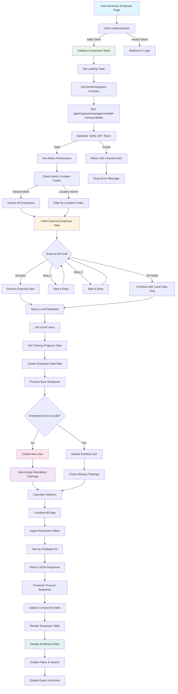
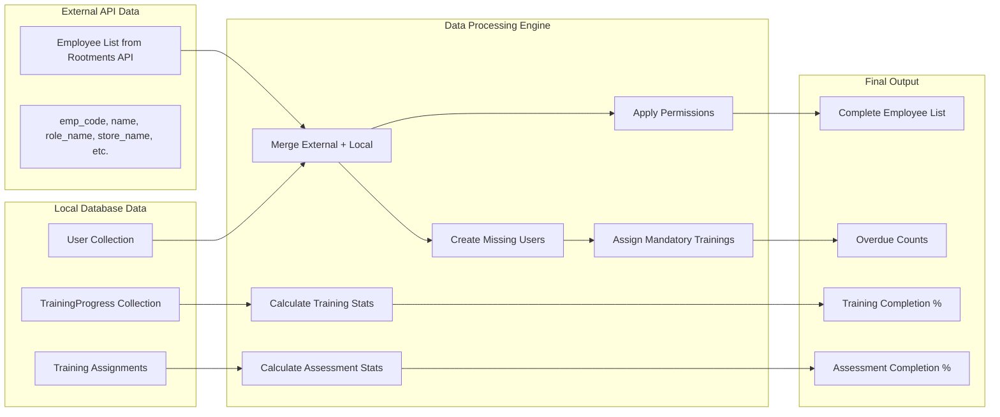
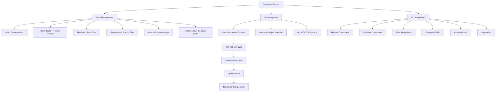
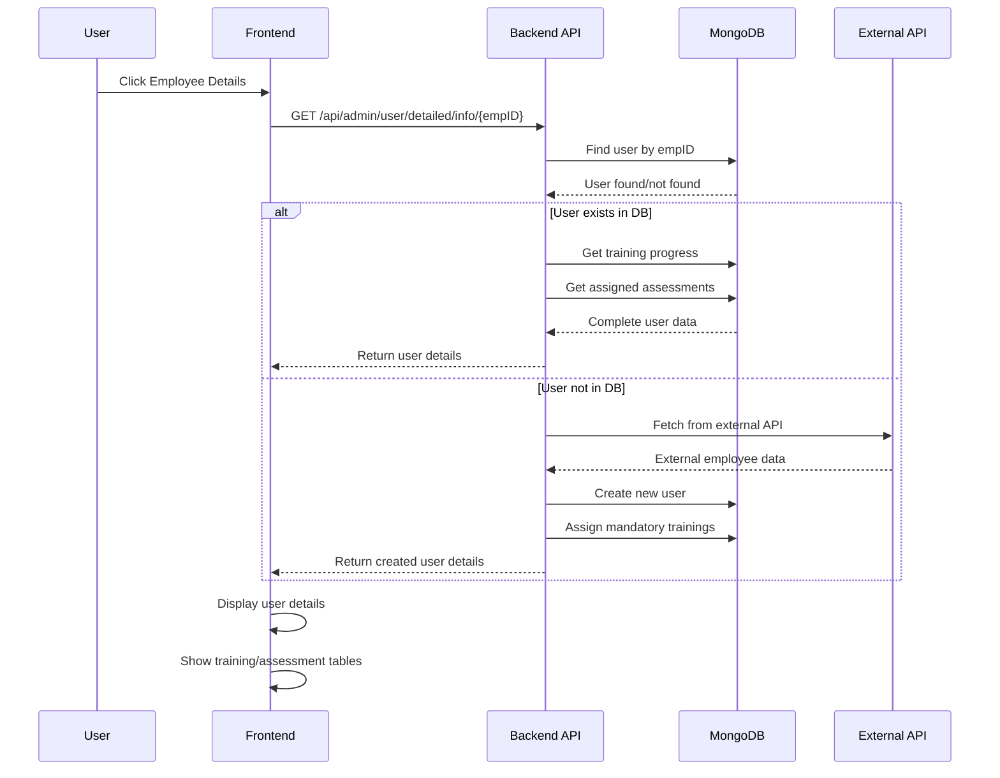
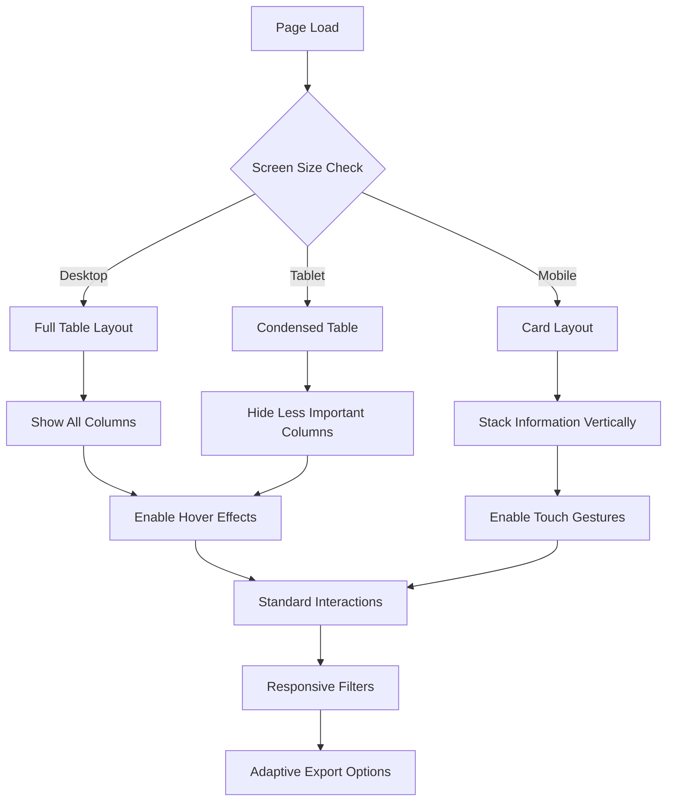
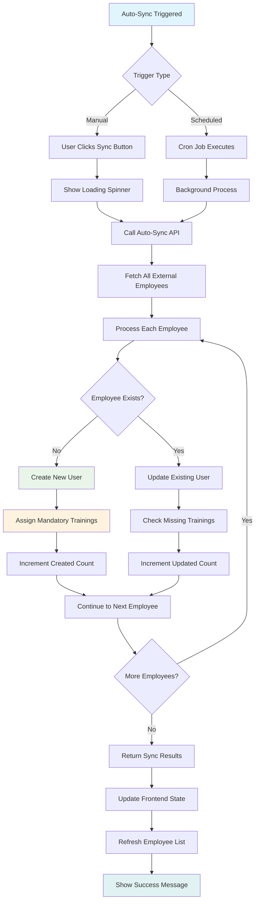
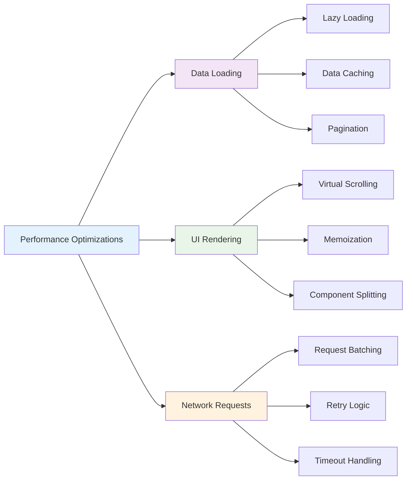

# Employee Page Data Loading - Detailed Flow Diagram

## 🔄 Complete Employee Page Flow



## 📊 Data Processing Pipeline



## 🏗️ Frontend Component Architecture



## 🔍 Employee Details Flow



## 📱 Responsive Design Flow



## ⚡ Auto-Sync Process Detail



## 🎯 Performance Optimization Points



## 🔧 Error Handling Flow

```mermaid
flowchart TD
    A[API Call] --> B{Response Status}
    B -->|200| C[Success - Process Data]
    B -->|401| D[Unauthorized - Redirect Login]
    B -->|404| E[Not Found - Show Message]
    B -->|500| F[Server Error - Retry Logic]
    B -->|Network Error| G[Connection Issue]
    
    C --> H[Update UI with Data]
    D --> I[Clear Token & Redirect]
    E --> J[Show "No Data" Message]
    F --> K{Retry Count < 3}
    G --> L[Show Offline Message]
    
    K -->|Yes| M[Wait & Retry]
    K -->|No| N[Show Error Message]
    M --> A
    
    H --> O[Enable User Interactions]
    I --> P[Login Page]
    J --> O
    N --> O
    L --> O
    
    style A fill:#e1f5fe
    style D fill:#ffebee
    style F fill:#fff3e0
    style O fill:#e8f5e8
```

## 📊 Data Flow Summary

### **Key Data Sources:**
1. **External API**: Employee master data from Rootments API
2. **Local Database**: Training progress, assignments, user modifications
3. **Real-time Calculations**: Completion percentages, overdue counts

### **Processing Steps:**
1. **Authentication**: Verify user permissions and location access
2. **Data Fetching**: Parallel fetch from external API and local database
3. **Data Merging**: Combine external and local data sources
4. **User Creation**: Auto-create missing users from external data
5. **Training Assignment**: Auto-assign mandatory trainings to new users
6. **Statistics Calculation**: Calculate completion percentages and overdue counts
7. **Permission Filtering**: Apply location-based access controls
8. **Response Formatting**: Format data for frontend consumption

### **Frontend Processing:**
1. **State Management**: Update component state with fetched data
2. **UI Rendering**: Render employee table with all data
3. **Filter/Search**: Enable real-time filtering and searching
4. **Export**: Generate CSV exports with current filter state
5. **Actions**: Enable employee detail navigation and bulk operations

This comprehensive flow ensures efficient data loading, real-time updates, and optimal user experience across all devices and user roles.
