# LMS (Learning Management System) - Complete Documentation

## 🏗️ System Architecture Overview


## 🎯 Core Features & Modules

### 1. **User Management**
- **Employee Management**: Add, view, edit, delete employees
- **Admin Management**: Create and manage admin users with role-based permissions
- **Auto-Sync**: Automatic synchronization with external employee API
- **Role-Based Access Control**: Super Admin, Admin, Trainer, User roles

### 2. **Training Management**
- **Training Creation**: Create video-based training modules
- **Mandatory Training**: Assign mandatory trainings based on employee designation
- **Training Assignment**: Assign specific trainings to users or groups
- **Progress Tracking**: Real-time tracking of training completion
- **Training Reassignment**: Reassign trainings with new deadlines

### 3. **Assessment Management**
- **Assessment Creation**: Create MCQ and descriptive assessments
- **Assessment Assignment**: Assign assessments to users
- **Assessment Tracking**: Monitor assessment completion and scores
- **Overdue Management**: Track and manage overdue assessments

### 4. **Module Management**
- **Video Modules**: Create modules with YouTube or direct video URLs
- **Question Attachment**: Attach questions to each video module
- **Module Visibility**: Control module visibility and access

### 5. **Branch Management**
- **Branch Creation**: Add and manage organizational branches
- **Location Mapping**: Map employees to specific branches
- **Branch Analytics**: View branch-wise performance metrics

### 6. **Analytics & Reporting**
- **Dashboard Analytics**: Real-time progress monitoring
- **Employee Performance**: Individual employee progress tracking
- **Branch Performance**: Branch-wise completion statistics
- **Overdue Reports**: Track overdue trainings and assessments

### 7. **Notification System**
- **Automated Notifications**: Cron job-based reminder system
- **Manual Notifications**: Create and send custom notifications
- **Escalation Management**: Multi-level escalation system

### 8. **Settings & Configuration**
- **Permission Management**: Configure admin permissions
- **Subrole Creation**: Create custom user subroles
- **Visibility Settings**: Control content visibility
- **Login Analytics**: Track user login patterns

## 📊 Employee Page Data Loading Flow

```mermaid
sequenceDiagram
    participant FE as Frontend (Employee Page)
    participant API as Backend API
    participant DB as MongoDB
    participant ExtAPI as External API
    participant Cache as Data Processing
    
    FE->>API: GET /api/employee/management/with-training-details
    Note over FE,API: With JWT token & cache-busting timestamp
    
    API->>DB: Check admin permissions
    DB-->>API: Return allowed location codes
    
    API->>ExtAPI: POST https://rootments.in/api/employee_range
    Note over API,ExtAPI: Direct call with authorization token
    ExtAPI-->>API: Return external employee data
    
    API->>DB: Query local users with training data
    DB-->>API: Return local user records
    
    API->>Cache: Process & combine data
    Note over Cache: • Merge external + local data<br/>• Calculate training statistics<br/>• Apply permission filters<br/>• Auto-create missing users
    
    Cache->>DB: Create new users if needed
    Cache->>DB: Assign mandatory trainings
    
    Cache-->>API: Return processed employee list
    API-->>FE: JSON response with complete data
    
    FE->>FE: Render employee table with:
    Note over FE: • Employee details<br/>• Training completion %<br/>• Assessment completion %<br/>• Overdue counts<br/>• Filter & search options
```



### Employee Data Loading Process Details:

#### 1. **Initial Request**
```javascript
// Frontend initiates request with authentication
const response = await fetch(`${baseUrl.baseUrl}api/employee/management/with-training-details?t=${Date.now()}`, {
  method: "GET",
  headers: { 
    "Content-Type": "application/json",
    'Authorization': `Bearer ${token}`,
  },
  credentials: "include",
});
```

#### 2. **Backend Processing Flow**
```javascript
// 1. Authentication & Permission Check
const admin = await Admin.findById(req.admin.userId);
const allowedLocCodes = admin.allowedLocCodes || [];

// 2. Fetch External Employee Data
const response = await axios.post('https://rootments.in/api/employee_range', {
  startEmpId: 'EMP1',
  endEmpId: 'EMP9999'
}, { 
  timeout: 30000,
  headers: {
    'Authorization': `Bearer ${ROOTMENTS_API_TOKEN}`,
  }
});

// 3. Query Local Database
const localUsers = await User.find(localUsersQuery);
const allTrainingProgress = await TrainingProgress.find({ 
  userId: { $in: allUserIds } 
});

// 4. Data Processing & Merging
// - Combine external and local data
// - Calculate training statistics
// - Apply permission filters
// - Auto-create missing users
// - Assign mandatory trainings
```

#### 3. **Data Structure Returned**
```json
{
  "success": true,
  "message": "Employee data with training details fetched successfully",
  "data": [
    {
      "empID": "EMP001",
      "username": "John Doe",
      "designation": "Manager",
      "workingBranch": "GROOMS TRIVANDRUM",
      "email": "john@company.com",
      "phoneNumber": "9876543210",
      "trainingCount": 5,
      "passCountTraining": 3,
      "trainingDue": 1,
      "trainingCompletionPercentage": 60,
      "assignedAssessmentsCount": 3,
      "passCountAssessment": 2,
      "assessmentDue": 1,
      "assessmentCompletionPercentage": 67,
      "isLocalUser": true,
      "hasTrainingData": true
    }
  ],
  "employeesWithTraining": 185,
  "totalEmployees": 229,
  "localUsers": 200,
  "externalEmployees": 225,
  "isGlobalAdmin": false
}
```

## 🔄 Complete System Flow


## 🏛️ Database Schema

### Core Models:

#### 1. **User Model**
```javascript
{
  empID: String,           // Employee ID
  username: String,        // Employee Name
  email: String,          // Email Address
  designation: String,     // Job Title/Role
  workingBranch: String,   // Branch Name
  locCode: String,         // Location Code
  phoneNumber: String,     // Contact Number
  training: [{             // Assigned Trainings
    trainingId: ObjectId,
    deadline: Date,
    pass: Boolean
  }],
  assignedAssessments: [{  // Assigned Assessments
    assessmentId: ObjectId,
    deadline: Date,
    pass: Boolean
  }]
}
```

#### 2. **Training Model**
```javascript
{
  trainingName: String,    // Training Title
  Trainingtype: String,    // "Mandatory" | "Optional"
  Assignedfor: [String],   // Target Designations
  modules: [ObjectId],     // Associated Modules
  deadline: Date,          // Training Deadline
  visibility: String       // Visibility Setting
}
```

#### 3. **TrainingProgress Model**
```javascript
{
  userId: ObjectId,        // User Reference
  trainingId: ObjectId,    // Training Reference
  trainingName: String,    // Training Name
  deadline: Date,          // Completion Deadline
  pass: Boolean,           // Completion Status
  modules: [{              // Module Progress
    moduleId: ObjectId,
    pass: Boolean,
    videos: [{
      videoId: ObjectId,
      pass: Boolean
    }]
  }]
}
```

## 🔐 Authentication & Authorization Flow


## 🔧 API Endpoints Overview

### **Authentication APIs**
- `POST /api/admin/login` - Admin login
- `POST /api/admin/verifyToken` - Token verification
- `POST /api/admin/createadmin` - Create admin users

### **Employee Management APIs**
- `GET /api/employee/management/with-training-details` - Get employees with training data
- `POST /api/employee/auto-sync` - Auto-sync employees
- `GET /api/admin/user/detailed/info/:id` - Get employee details
- `PUT /api/admin/user/update/:id` - Update employee

### **Training Management APIs**
- `POST /api/admin/create/training` - Create training
- `POST /api/admin/assign/training` - Assign training
- `GET /api/admin/get/training/:id` - Get training details
- `POST /api/admin/create/mandatorytraining` - Create mandatory training

### **Assessment Management APIs**
- `POST /api/admin/create/assessment` - Create assessment
- `POST /api/admin/assign/assessment` - Assign assessment
- `GET /api/admin/assessment/:id` - Get assessment details

### **Analytics & Reporting APIs**
- `GET /api/admin/get/HomeProgressData` - Dashboard analytics
- `GET /api/admin/get/progress` - Progress statistics
- `GET /api/admin/get/bestThreeUser` - Top performers

## 🎨 Frontend Architecture

### **Component Structure**
```
src/
├── components/
│   ├── Header/          # Navigation header
│   ├── SideNav/         # Sidebar navigation
│   ├── HomeBar/         # Dashboard charts
│   ├── Quick/           # Quick action buttons
│   ├── RoundBar/        # Circular progress indicators
│   ├── Skeleton/        # Loading skeletons
│   └── Notification/    # Notification components
├── pages/
│   ├── Home/            # Dashboard pages
│   ├── Employee/        # Employee management
│   ├── Training/        # Training management
│   ├── Assessments/     # Assessment management
│   ├── Branch/          # Branch management
│   ├── Modules/         # Module management
│   ├── Setting/         # System settings
│   ├── OverDue/         # Overdue tracking
│   └── Notification/    # Notification management
└── api/
    └── api.js           # API configuration
```

### **State Management**
- **Redux Toolkit** for global state management
- **Local State** for component-specific data
- **localStorage** for token persistence

## 🚀 Key Features Implementation

### **Auto-Sync Functionality**
1. **Scheduled Sync**: Runs every 6 hours via cron jobs
2. **Manual Sync**: Triggered by admin users
3. **Data Merging**: Combines external API data with local database
4. **User Creation**: Automatically creates missing users
5. **Training Assignment**: Auto-assigns mandatory trainings

### **Mandatory Training System**
1. **Designation-Based**: Trainings assigned based on employee designation
2. **Automatic Assignment**: New users get relevant trainings automatically
3. **Progress Tracking**: Real-time monitoring of completion status
4. **Deadline Management**: Automatic deadline setting and tracking

### **Permission System**
1. **Location-Based**: Admins can only see employees from assigned locations
2. **Role-Based**: Different access levels for different user roles
3. **Feature-Based**: Granular control over feature access

## 📱 Responsive Design

- **Mobile-First**: Optimized for mobile devices
- **Adaptive Layout**: Responsive design for all screen sizes
- **Touch-Friendly**: Mobile-optimized interactions
- **Progressive Enhancement**: Core functionality works on all devices

## 🔍 Search & Filter System

- **Real-time Search**: Instant search across employee data
- **Multi-Filter**: Filter by designation, branch, completion status
- **Advanced Filters**: Date ranges, performance metrics
- **Export Functionality**: CSV export with filtered data

## 📈 Performance Optimizations

- **Lazy Loading**: Components loaded on demand
- **Data Caching**: Cache-busting for real-time data
- **Pagination**: Large datasets handled efficiently
- **Optimistic Updates**: Immediate UI feedback
- **Error Boundaries**: Graceful error handling

## 🔒 Security Features

- **JWT Authentication**: Secure token-based authentication
- **Role-Based Access**: Granular permission system
- **Input Validation**: Server-side validation for all inputs
- **CORS Configuration**: Proper cross-origin request handling
- **Environment Variables**: Secure configuration management

## 📊 Monitoring & Analytics

- **Login Analytics**: Track user login patterns
- **Performance Metrics**: Training and assessment completion rates
- **Usage Statistics**: System usage and adoption metrics
- **Error Tracking**: Comprehensive error logging and monitoring

This LMS system provides a comprehensive solution for organizational training management with robust features for user management, content delivery, progress tracking, and analytics.
